<h1>RESTAURANT MANAGEMENT AUTOMATİON APPLICATION</h1>

<h2>Project Goal:</h2>
<pre align="left">
    The aim of the project is to create a graphical user interface for      the application and store data.The graphical user interface has an     interactive effect of all methods given in the RestorantApplication class. 
    Swing(JFrame,JButton,JLabel, etc.) is used to implement the user interface.

<h3>   The project adheres to the SOLID principles.What is SOLID?:</h3>
    
    SOLID is an acronym that represents a set of principles used for software
    design.SOLID consists of five principles,namely "S"(Single Responsibility
    Principle),"O"(Open/Closed Principle),"L"(Liskov's Substitution Principle),
    "I"(Interface Segregation Principle) and "D"(Dependency Inversion Principle).

    
    These principles are used to improve the quality of software design,
    increase reusability and ease of maintenance, make the code more readable and
    understandable and prevent problems that may arise during software development.</hp>
    
<i>    (S) Single Responsibility Principle:</i> A class, function, or method should have
    only one responsibility, In other words, a class or function should do only
    one job.

    
<i>    (O) Open-Closed Principle: </i> Software components should be closed to change
    (closed principle) and open to extension(open principle).When the behavior
    of a component needs to be changed, new features or modifications to existing
    features should be possible without touching the source code of that component.
    

    
<i>    (L) Liskov's Substitution Principle: </i>A subclass should be able to replace its
    superclass.In other words, a subclass should be able to use the superclass's
    functions and be usable by the superclass's users without adding any additional
    behavior.

    
<i>    (I) Interface Segregation Principle: </i>An interface should not contain methods
    that are unnecessary for its functionality.In other words, an interface should
    only contain the methods necessary for its functionality.

   
<i>    (D) Dependency Inversion Principle: </i>High-Level modules should not be dependent
    on low-level modules. The dependency between two modules should depend on their
    abstractions.

</pre>

<h2>Tech I use: </h2>

<h2>Application Steps:</h2>
A customer registers and logs in.
<pre><b>For the Customer:</b>
        -Add Order:
            Select what they want from the listed dishes.
            Select the quantity.
            Add order.
        -Make Reservation:
            Select the table number.
            Enter the Name,Phone and Email.
            Make a reservation.
        -Add Order to Reservation:
            Search for a table, continue if found.
            Enter the dish name, add extra notes.
            Add the order to the reservation.
</pre>
<pre><b>For the staff:</b>
    -Add Customer:
        Staff logs in.
        Enter the customer's information.
        Add the customer.
    -Delete Customer:
        Enter customer username.
        Delete customer.
    -Customer Details:
        Enter customer username.
        List customer details.
    -All Orders:
        View all orders.
</pre>
<pre><b>For Manager:</b>
    -Add staff:
        Login as manager.
        Enter staff name.
        Enter staff salary.
        Add staff.
    -Delete staff:
        Enter staff information.
        Delete staff.
    View all staff:
        View all staff.
</pre>

<h2>Screenshot: </h2>
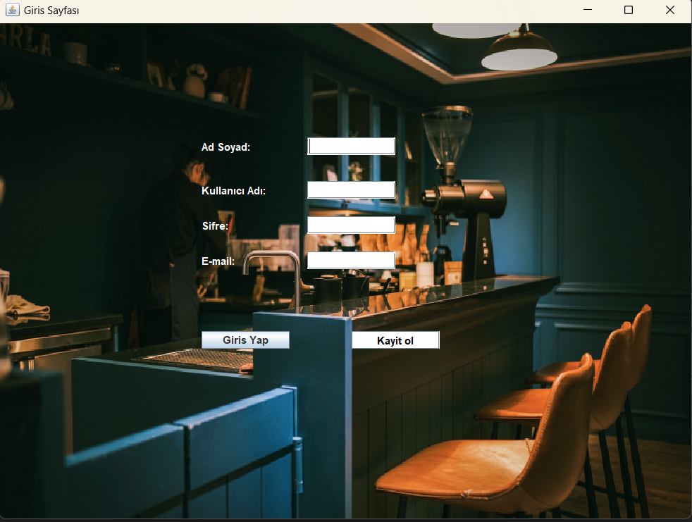
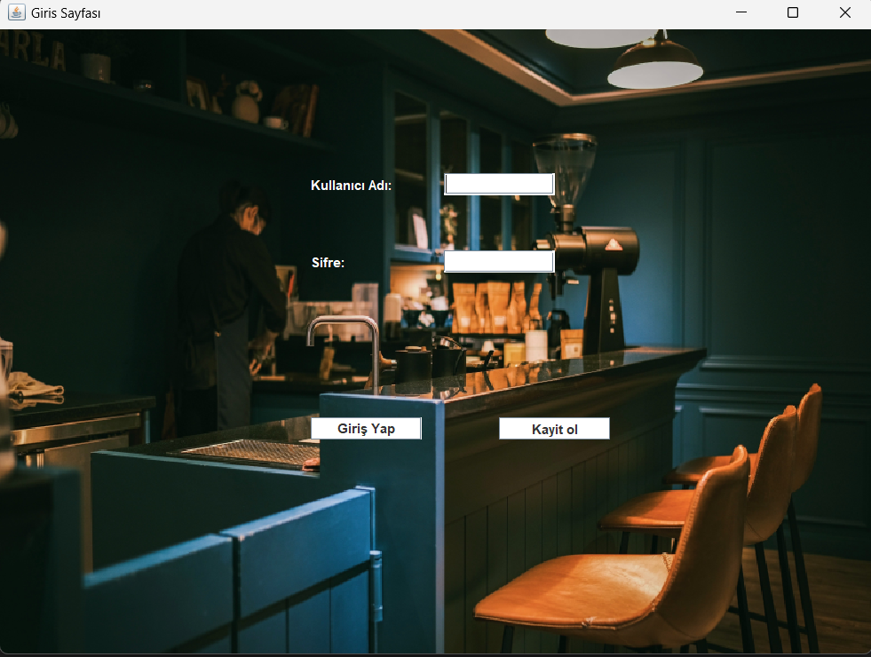
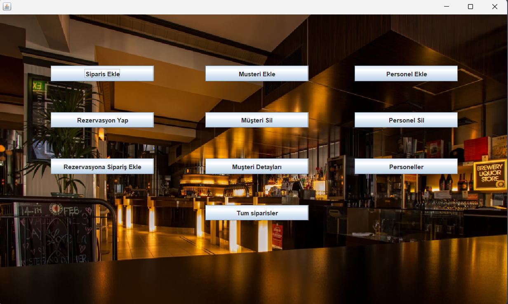
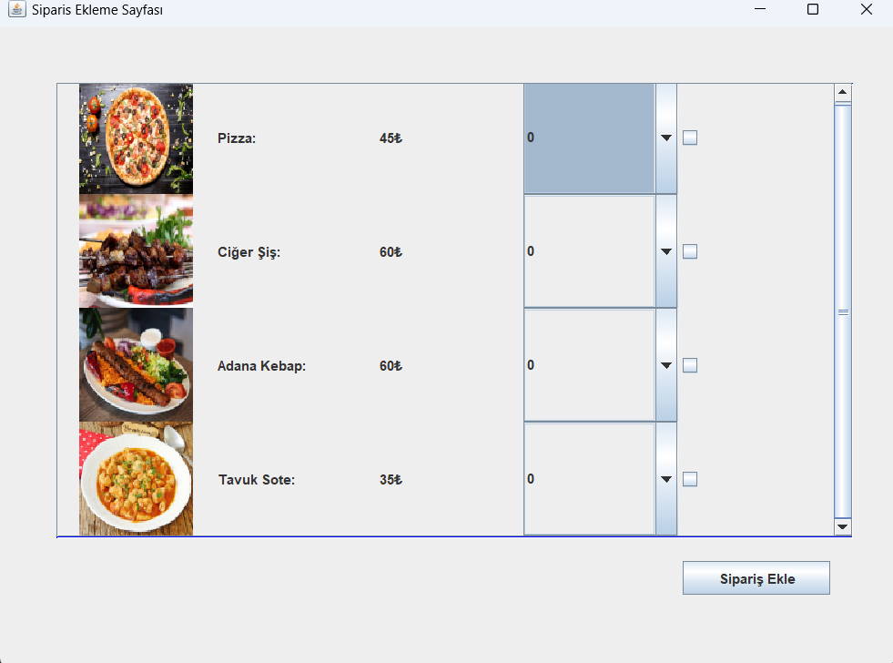
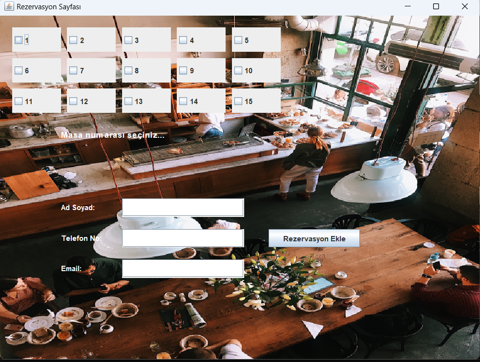
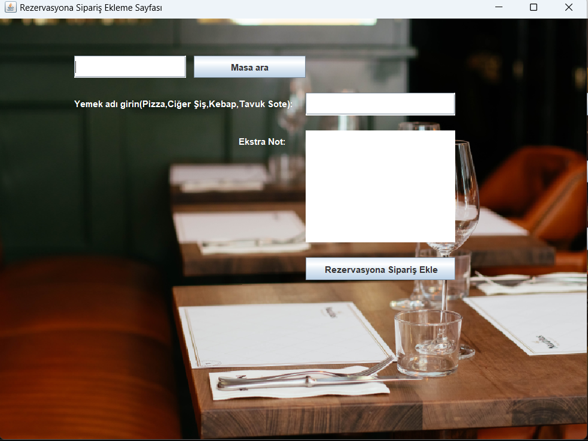
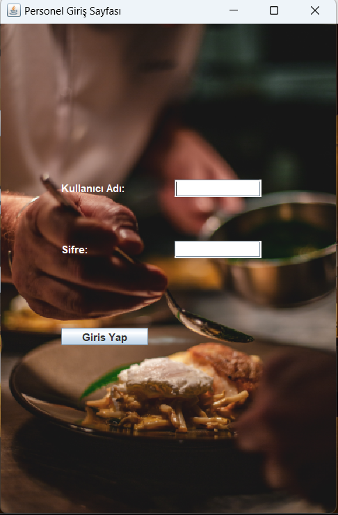
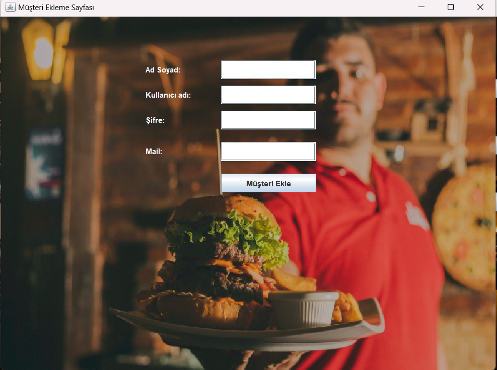
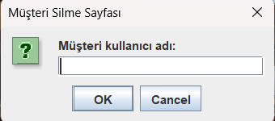
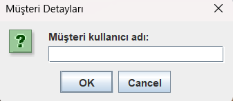
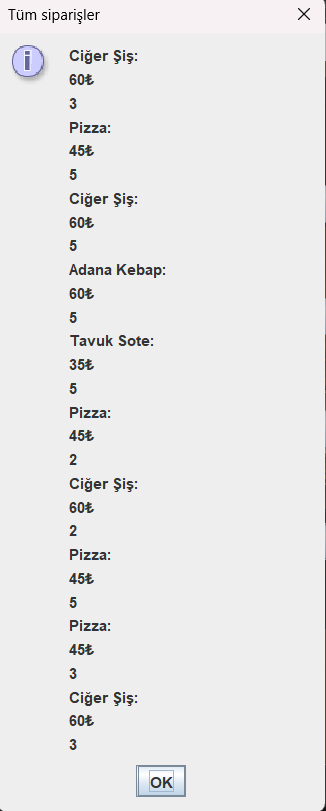
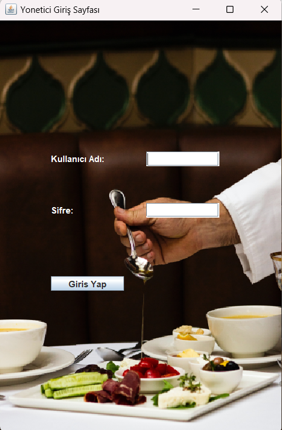
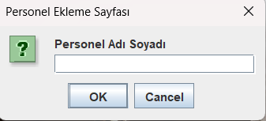
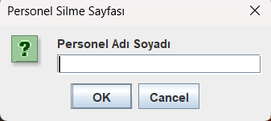
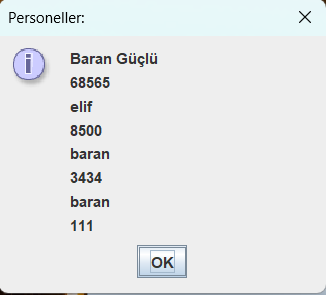

